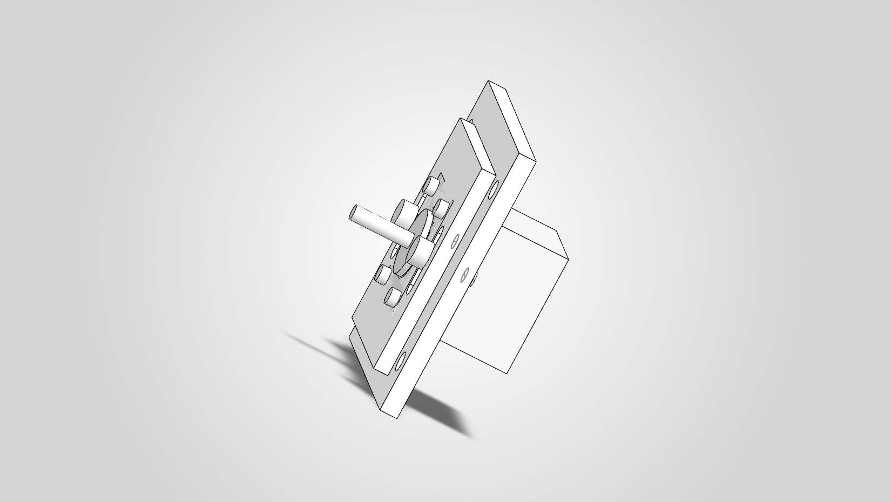
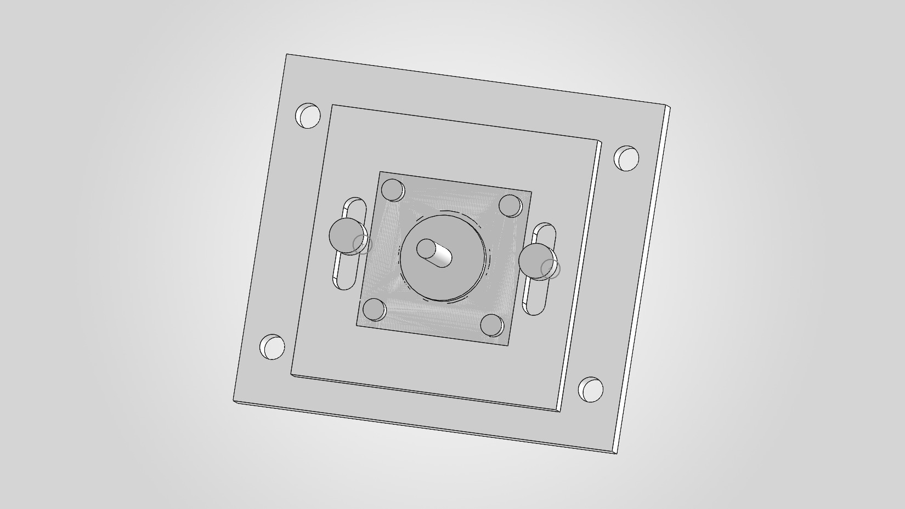
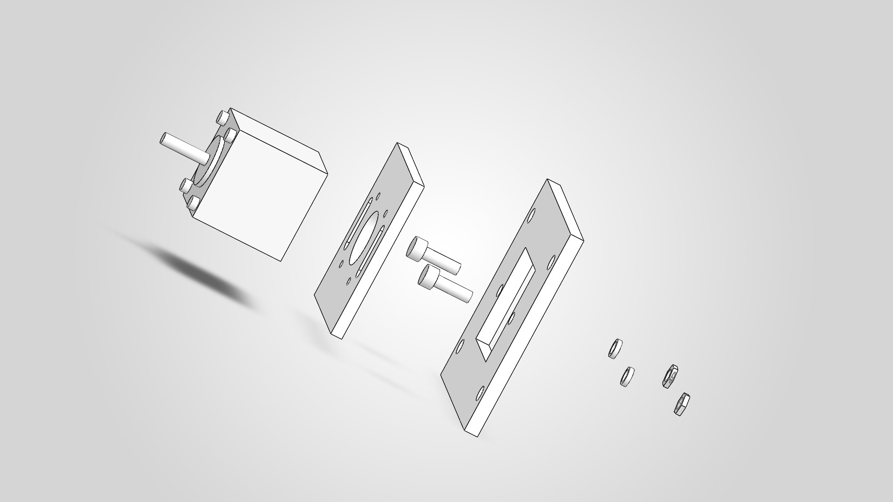

# Adjustable Motor Mount for a NEMA 17 Stepper Motor

**Status:** Completed portfolio CAD project with preliminary static checks.

## Project Overview

This project presents a compact adjustable motor mount modeled in SolidWorks. A motor plate slides relative to a fixed base plate, allowing the motor position to be adjusted along one axis for alignment or belt tensioning. The project includes part and assembly models, engineering drawings, an exploded view, a bill of materials, and documented calculations.

## Design Goal

Create a simple mount that holds the project motor representation securely, provides at least 18 mm of usable linear adjustment, uses standard fasteners, and can be manufactured from flat plate using conventional cutting, drilling, and slot-machining operations.

## Portfolio Images

*Assembled motor mount.*

*Close-up of the two-slot adjustment mechanism.*

*Exploded view showing the motor, plates, and adjustment hardware.*

## Key Dimensions

| Feature | Approved value |
| --- | ---: |
| Base plate | 100 x 90 x 6 mm |
| Motor plate | 70 x 70 x 5 mm |
| Adjustment slot width | 6 mm |
| Distance between slot end-arc centers | 18 mm |
| Overall slot length | 24 mm |
| Conservative usable linear adjustment | 18 mm |
| Motor mounting-hole pattern | 31 x 31 mm, four M3 holes |
| Simplified CAD motor body | 40 x 40 mm |

## Adjustment Mechanism

The motor is attached to the motor plate with four M3 x 10 mm bolts. Two parallel slots allow the motor plate to translate relative to the base plate. Two M5 x 16 mm bolts, flat washers, and hex nuts clamp the plates after the desired position is set; friction between the clamped plate surfaces resists sliding.

## Material Selection

The base plate and motor plate are specified as **Aluminum 6061-T6**. Purchased fastening hardware is standard zinc-plated steel as listed in the BOM.

## Approved Calculation Summary

| Check | Result | Approved basis |
| --- | ---: | --- |
| Adjustment travel | 18 mm | 24 mm overall slot length minus two 3 mm end radii |
| Load per M5 bolt | 15 N | Provisional 30 N lateral load shared equally by two bolts |
| Motor-plate slot bearing stress | 0.60 MPa | 15 N over a 5 mm x 5 mm projected area |
| Average M5 bolt shear stress | Approximately 0.76 MPa | 15 N over a 19.63 mm² nominal area |
| Required clamping force | 150 N total; 75 N per bolt | Assumed dry aluminum-to-aluminum friction coefficient of 0.20 |

The 30 N lateral load is a provisional portfolio design assumption. The friction coefficient of 0.20 is an engineering assumption and was not experimentally measured. These calculations are simplified static checks intended to demonstrate basic design reasoning, not a certified structural analysis. See the [calculation document](Calculations/Motor%20Mount%20Calculations.pdf) for the engineering explanation.

## BOM Summary

The assembly contains two custom plates, two M5 adjustment fastener sets, four M3 motor-mounting bolts, and one simplified motor representation. Estimated costs remain **TBD**.

- [BOM - Excel](BOM/Motor_Mount_BOM.xlsx)
- [BOM - CSV](BOM/Motor_Mount_BOM.csv)

## Drawings

- [Assembly drawing and BOM](SolidWorks/Motor_Mount_Assembly_Drawing.pdf)
- [Base plate drawing](SolidWorks/Base_Plate_Drawing.pdf)
- [Motor plate drawing](SolidWorks/Motor_Plate_Drawing.PDF)

## Motor Representation Note

The 40 x 40 mm motor body is a simplified NEMA 17-style CAD representation, not a verified commercial NEMA 17 envelope. The model retains the 31 x 31 mm M3 mounting pattern, but final fit with a specific commercial motor requires verification against its datasheet and a physical fit check.

## Project Documents

- [Final Report](Documentation/Motor_Mount_Final_Report.pdf)
- [Project Requirements](Requirements/Project%20Requirements.pdf)
- [Engineering Calculations](Calculations/Motor%20Mount%20Calculations.pdf)
- [BOM - Excel](BOM/Motor_Mount_BOM.xlsx)